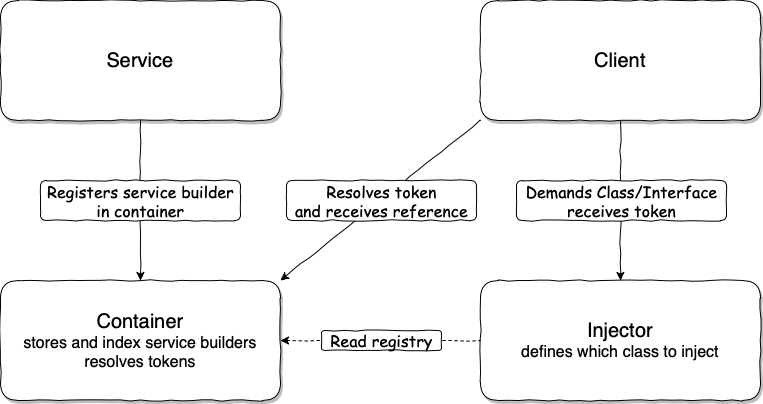

# micro-di

A lightweight, minimal module for allowing dependency-injection in your frontend app.
Written in [TypeScript](https://www.typescriptlang.org/) and recommended to use mostly in TypeScript projects that care about artifact size.

[](https://github.com/HereMobilityDevelopers/micro-di/raw/master/LICENSE)
[](https://travis-ci.com/HereMobilityDevelopers/micro-di)
[](https://coveralls.io/github/HereMobilityDevelopers/micro-di?branch=master)

# What's in it for me?

Dependency Injection (DI) is a design pattern used to implement IoC (Inversion of Control). It allows the creation of dependent objects outside of a class and provides those objects to a class through different ways. Using DI, we move the creation and binding of the dependent objects outside of the class that depends on them.

The Dependency Injection pattern usually involve following types of classes:

**Client Class**: The client class (dependent class) is a class which depends on the service class.

**Service Class**: The service class (dependency) is a class that provides service to the client class.

**Container Class**: The container class is a class that associates token with the service class.

**Injector Class**: The injector class injects the token into the client class following by its internal logic.

Later the client will resolve the injected token from the container and receive an instance of the service or another compatible class. The following figure illustrates the relationship between these classes:



As you can see, in this approach, the DI pattern separates the responsibility of creating an object instance from the service class outside of the dependent client class, which reduces coupling between service and client classes.

# Features

micro-di is simple to use. It implements only two actions required for DI - registration and resolution of the dependencies. When used with decorators, micro-di allows building the dependency graph "automatically" inline with the class definition. Dependencies are registered in the IoC container as functions that return an object instance (ctor) and are lazily loaded (resolved only upon first access).

# Limitations

This library does not support cyclic dependency detection, it is up to the developer to avoid a dependency graph with cycles. Also, micro-di has only one global IoC container. Each class can have only one entry per class token. Named string tokens are unlimited but have to be unique.

# Installation

To install using the **npm** package manager, run the following command:

`$ npm install @here-mobility/micro-di --save`

To install using the **yarn** package manager:

`$ yarn add @here-mobility/micro-di`

# Project Configuration

Following parameters should be enabled in your `tsconfig.json`:

```json
{
  "compilerOptions": {
    "experimentalDecorators": true,
    "emitDecoratorMetadata": true
  },
}
```

# Usage

### Dependency Registration

Register `SomeFactory` as a dependency using `RegisterDependency` method. This can be done anywhere in your application code:

```typescript
import { RegisterDependency } from "@here-mobility/micro-di";
import { SomeFactory } from "some-factory.js";

RegisterDependency(SomeFactory, () => new SomeFactory("param"))
```

Register `SomeClass` using `RegisterSingleton` method. `RegisterSingleton` registers a resolver function which will be resolved to the constructed instance the first time `SomeClass` dependency is accessed. After the first time, the resolved instance will be stored in the container and subsequent access to `SomeClass` will always return the same instance as a Singleton.

```typescript
import { RegisterSingleton } from "@here-mobility/micro-di";
import { SomeClass } from "some-class.js";

RegisterSingleton(SomeClass, () => new SomeClass("param"))
```

It is possible to register dependencies by using [Experimental-Decorators](https://www.typescriptlang.org/docs/handbook/decorators.html). The same two options are available with decorators. `Resolvable` decorator registers resolver function as is:

```typescript
import { Resolvable } from "@here-mobility/micro-di";

const counter = 0;

@Resolvable(() => new NameFactory())
@Resolvable("NameFactory") // Register multiple distinct dependencies
class NameFactory {
  getName() {
    return `Token#${counter}`
  }
}
```

`Singleton` decorator will register a single instance of this object:

```typescript
import { Singleton } from "@here-mobility/micro-di";

@Singleton()
class Locator {
  constructor(name) {
    ...
  }
}
```

### Dependency Resolution

Dependency can be resolved by using `Resolve` method. This can be done anywhere in your application code:

```typescript
import { Resolve } from "@here-mobility/micro-di";
import { NameFactory } from "named-factory.js";

const instance = Resolve(NameFactory);
const second = Resolve<NameFactory>("NameFactory"); // String token can be resolved to any type

```

Dependency can be injected to constructor arguments automatically:

```typescript
import { MapInject, Construct } from "@here-mobility/micro-di";

const instance = Construct(DependantClass);

class DependantClass {
  name: string = "noname";

  constructor(
    @Inject("NameFactory")
    private factory: NameFactory,

    @Inject(Locator)
    private prop: Locator
  )

  giveName() {
    this.name = this.factory.getName();
  }
}
```

Dependency can also be injected by using experimental-decorator `Dynamic` or `Lazy`:

```typescript
import { Dynamic, Lazy } from "@here-mobility/micro-di";
import { Locator } from "locator.js";

class DependantClass {
  @Dynamic("NameFactory")
  factory!: NameFactory;

  @Lazy(Locator)
  private prop!: Locator;

  name: string = "noname";

  giveName() {
    this.name = this.factory.getName();
  }
}
```

### Overriding Dependencies in tests

Dependencies in unit tests can be simply overridden with relevant mocks without touching the properties of the actual object under test. Use `OverrideResolver` and `OverrideSingleton` methods where applicable accordingly:

Example of `register-mocks.js`:

 ```typescript
import { MockFactory, MockLocator } from "mocks"
import { Locator } from "locator.js";
import { NameFactory } from "named-factory.js";

OverrideSingleton(Locator, () => new MockLocator());
OverrideResolver(NameFactory, () => new MockFactory());
```

Using in the test case:

```typescript
import "./register-mocks.js";
import { DependantClass } from "@/dependant-class.ts";
import { MockFactory } from "mocks"

describe("DependantClass", () => {
  const testedClass = DependantClass();
  const mockFactory = Resolve("NameFactory") as MockFactory;

  it("can be named", () => {
    testedClass.giveName();
    expect(mockFactory.lastGetNameCaller).toEqual(testedClass);
    expect(testedClass.name).toEqual(mockFactory.mockedName);
  });
});

```
